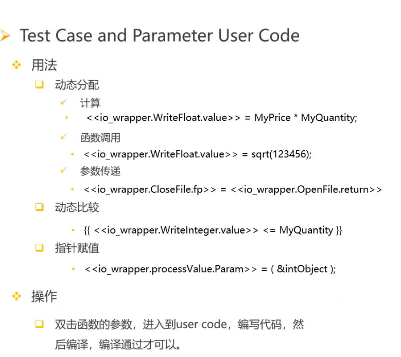

# 单元测试进阶详解

## 类型支持

### 浮点数偏差

floating point tolerance 偏差
floating points digits of precision 精度（有效数字位数）

#### 作用域

支持测试环境、测试用例、参数

### 结构体类型

支持解析结构体，可直接在GUI界面种 对结构体的所有成员进行赋值、

### 数组类型

collapse used children 折叠
expand first array index 扩展/展开
expand all array indices 扩展/展开

### 指针类型

## 桩函数

代替测试单元中调用的子模块的实体，是模拟被测试单元所调用的模块。

### SBF

### Libray Stubs

在这里提及对C语言直接使用函数名即可。对于C++要使用命名空间+函数名，如果要选择命令空间下所有函数均进行加桩，使用命名空间+'*'即可。
【注】我使用命名空间+函数名不起作用，另外我也好奇对STL中类的成员函数如何操作。

【猜测】我是否可以在Build的七步中的User Code(Optional)的User Global中，将库函数所在的头文件加在extern "c"中，以此来避免extern "c" link error.

### Additional Stubs

### Suppressed Stub

当UUT使用SBF选项为模板函数插桩时，会产生一些问题。比如它生成的桩与实际的桩类型不匹配。这时就会报错（有关键字SBF），这时就需要对该函数进行减桩。

## User Code

通过手写代码来自定义测试套件。

### Environment User Code

为所有的测试用例执行

### Test Case User Code

### Parameter User Code

